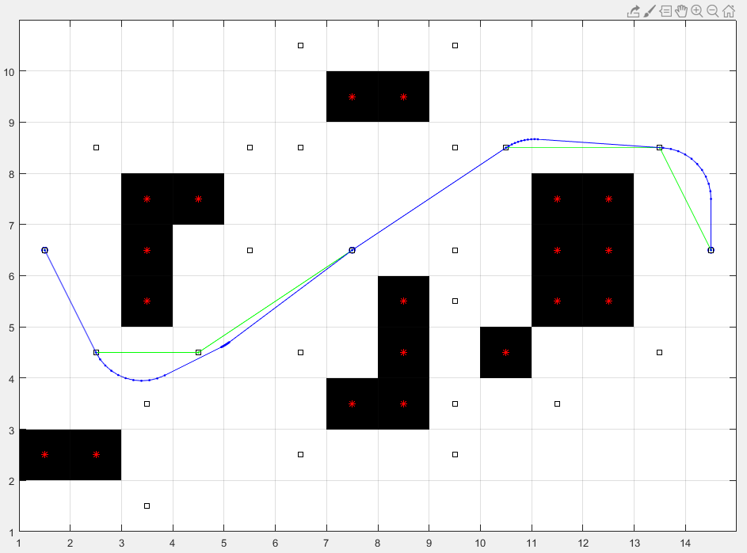

# matlab-dubins
Dubins Path implementation on matlab

 

### constructor
Dubins(array of waypoint[x y],dubinsRadius,softingPoint)

### result
array of <struct: x y>

### info 
- greater softingPoint make dubins circle softer but require more computing
- result can be accessed in Dubins.result [array of<struct: x y>]
    
### example
```matlab
waypoint = [1 1 ; 4 3 ; 8 7]; radius = 1;
dubins = Dubins( waypoint , radius , 10);
result = dubins.result;
```
